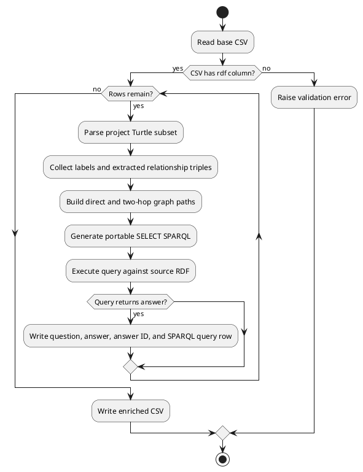

# Step 2: Enrich CSV with SPARQL Queries

This step reads the generated `identifier,description,rdf,triples`
CSV and writes its own compact enrichment CSV:

```text
identifier,description_identifier,question,sparql,answer,answer_id,id_sparql
```

The enriched CSV references the generated row through `description_identifier`.
It does not duplicate the generated `description`, `rdf`, or `triples` columns.
The `identifier` column is generated for each question row from the source
entity, such as `Jaguar_01`.

Each row has:

```text
question,sparql,answer,answer_id,id_sparql
```

`answer_id` stores the expected Wikidata identifier when available, while
`id_sparql` checks whether that identifier occurs in the evaluated graph.

Each generated description row can produce up to 3 enrichment question rows.

The rows contain graph traversal paths and SPARQL queries for direct and two-hop
navigational checks. The main `sparql` matches the expected subject and answer
labels and requires a direct or two-hop connection between them. The separate
`id_sparql` addresses every graph entity in the path directly by its
Wikidata IRI and does not look up an ID from a label or require a particular
predicate name. Before a query is written to the enriched CSV, the enrichment
step executes it against the source RDF with
`rdflib`; only queries that return the expected `answer` are kept.

## Run

From the project root, after generating `data/wikidata_description_rdf.csv`:

```powershell
python enrich/src/main.py
```

This writes:

```text
data/wikidata_description_rdf_enriched.csv
```

## Options

Use custom input and output paths:

```powershell
python enrich/src/main.py --input data/wikidata_description_rdf.csv --output data/enriched.csv
```

The output directory is created automatically when needed.

## Flow

The enrichment process is also documented as PlantUML in
[`enrich_flow.puml`](enrich_flow.puml).



## Generated SPARQL Shape

For a relationship such as:

```turtle
wd:Q37020055 kg:is wd:Q35409 .
```

the generated query addresses `wd:Q37020055` and `wd:Q35409` directly and
returns the readable answer `family`:

```sparql
SELECT ?answer WHERE {
  <http://www.wikidata.org/entity/Q37020055>
      ?predicate1 ?answer .
  FILTER(?answer = <http://www.wikidata.org/entity/Q35409>)
} LIMIT 1
```

## Files

| File | Responsibility |
| --- | --- |
| `enrich/src/main.py` | Convenience script entry point. |
| `enrich/src/enrich_pipeline/cli.py` | Enrichment command-line interface. |
| `enrich/src/enrich_pipeline/parsing/` | Turtle subset parser. |
| `enrich/src/enrich_pipeline/evaluation/` | Graph path, question, and SPARQL builders. |
| `enrich/src/enrich_pipeline/io/` | Compact enrichment CSV writer. |
| `enrich/src/enrich_pipeline/models/` | Shared enrichment dataclasses. |
