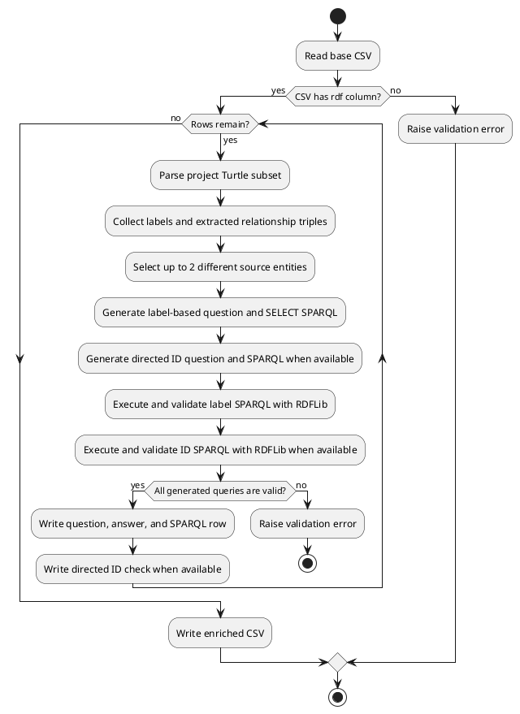

# Step 2: Enrich CSV with SPARQL Queries

This step reads the generated `identifier,description,rdf,triples`
CSV and writes its own compact enrichment CSV:

```text
identifier,description_identifier,question,query_type,sparql,answer
```

ID-based checks are written separately to
`data/wikidata_id_sparql.csv`:

```text
identifier,description_identifier,question,answer_id,id_sparql
```

The enriched CSV references the generated row through `description_identifier`.
It does not duplicate the generated `description`, `rdf`, or `triples` columns.
The `identifier` column is generated for each question row from the source
identifier. For example, source `Jaguar_01` can produce `Jaguar_01_01`.

Each row has:

```text
question,sparql,answer
```

`query_type` is `entity` for the first query and `predicate` for the second.
The entity `answer` stores a JSON list containing all entities linked to the
selected source; the predicate `answer` stores the local names of predicates
linked to that source. `answer_id` stores the expected
Wikidata identifier for the directed `id_sparql` check when available, while
`id_sparql` checks whether that identifier occurs in the evaluated graph.

Each generated RDF row produces up to 2 enrichment question rows: one for
linked entities and one for predicates.

The rows contain portable entity and predicate SPARQL queries. One preferred
source entity is selected for each RDF. Each main `sparql` locates the source
using the first word of its label as a case-insensitive whole-word regular
expression and returns all entities or predicates connected to it. Every result
identifies the edge as `incoming` or `outgoing`; there is no graph-wide fallback
when the source label is absent.
Labels are used only to present readable answers when available. The separate
`id_sparql` preserves the original directed ID-path format: it fixes the source
and expected answer IRIs while leaving the predicate variable. The main
`answer` is populated from the query's actual local result, and the ID query
must return its expected Q-ID. A validation failure aborts enrichment.

The generated question describes the full result set rather than a particular
path or predicate:

```text
Which entities are directly linked to Carina?
```

The companion `wikidata_id_sparql` CSV uses a directed yes/no question naming
both entities, for example:

```text
is the entity Carina directly linked to car?
```

## Run

From the project root, after generating `data/wikidata_base.csv`:

```powershell
python enrich/src/main.py
```

This writes:

```text
data/wikidata_label_sparql.csv
data/wikidata_id_sparql.csv
```

## Options

Use custom input and output paths:

```powershell
python enrich/src/main.py --input data/wikidata_base.csv --output data/label_sparql.csv
```

Choose the companion ID-query output path with `--id-output`:

```powershell
python enrich/src/main.py --id-output data/id_sparql.csv
```


The output directory is created automatically when needed.

## Flow

The enrichment process is also documented as PlantUML in
[`enrich_flow.puml`](docs/enrich_flow.puml).



## Generated SPARQL Shape

For a relationship such as:

```turtle
wd:Q37020055 kg:is wd:Q35409 .
```

the main query locates the source by a label regex and returns every directly
linked entity, regardless of edge direction or predicate:

```sparql
PREFIX rdfs: <http://www.w3.org/2000/01/rdf-schema#>
SELECT DISTINCT ?answer ?subject ?subjectLabel ?direction ?predicate ?answerEntity ?answerLabel WHERE {
  ?subject rdfs:label ?subjectLabel .
  FILTER(REGEX(STR(?subjectLabel), '\\bexample\\b', 'i'))
  {
    ?subject ?predicate ?answerEntity .
    BIND("outgoing" AS ?direction)
  }
  UNION
  {
    ?answerEntity ?predicate ?subject .
    BIND("incoming" AS ?direction)
  }
  FILTER(?predicate != rdfs:label)
  OPTIONAL { ?answerEntity rdfs:label ?answerLabel . }
  BIND(COALESCE(STR(?answerLabel), STR(?answerEntity)) AS ?answer)
}
```

## Files

| File | Responsibility |
| --- | --- |
| `enrich/src/main.py` | Convenience script entry point. |
| `enrich/src/enrich_pipeline/cli.py` | Enrichment command-line interface. |
| `enrich/src/enrich_pipeline/parsing/` | Turtle subset parser. |
| `enrich/src/enrich_pipeline/evaluation/` | Linked-entity question and SPARQL builders. |
| `enrich/src/enrich_pipeline/io/` | Compact enrichment CSV writer. |
| `enrich/src/enrich_pipeline/models/` | Shared enrichment dataclasses. |

The enrichment implementation keeps parsing, selection, query construction,
execution, validation, and serialization independent. Each source Turtle value
is parsed once as an RDFLib graph and reused when executing the label query and
the optional Q-ID query. Label answers are serialized in deterministic,
case-insensitive order so repeated runs produce stable CSV output.
