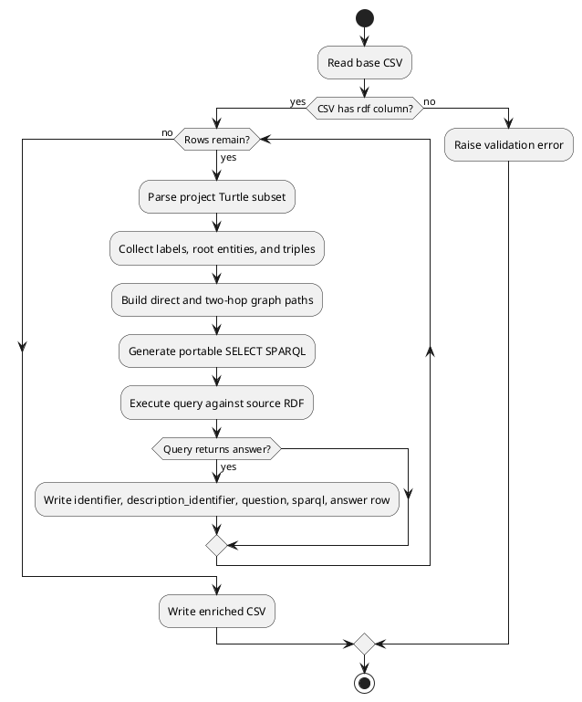

# Step 2: Enrich CSV with SPARQL Queries

This step reads the generated `identifier,description,rdf,triples`
CSV and writes its own compact enrichment CSV:

```text
identifier,description_identifier,question,sparql,answer
```

The enriched CSV references the generated row through `description_identifier`.
It does not duplicate the generated `description`, `rdf`, or `triples` columns.
The `identifier` column is generated for each question row from the source
entity, such as `Jaguar_01`.

Each row has:

```text
question,sparql,answer
```

Each generated description row can produce up to 3 enrichment question rows.

The rows contain graph traversal paths and SPARQL queries for direct and two-hop
navigational checks. The queries use `rdfs:label` values to identify entities
whenever labels are available. Before a query is written to the enriched CSV,
the enrichment step executes it against the source row's Turtle RDF with
`rdflib`; only queries that return the expected `answer` are kept.

## Run

From the project root, after generating `wikidata_description_rdf.csv`:

```powershell
python enrich/src/main.py
```

This writes:

```text
wikidata_description_rdf_enriched.csv
```

## Options

Use custom input and output paths:

```powershell
python enrich/src/main.py --input wikidata_description_rdf.csv --output enriched.csv
```

## Flow

The enrichment process is also documented as PlantUML in
[`enrich_flow.puml`](enrich_flow.puml).



## Generated SPARQL Shape

For a relationship such as:

```turtle
wd:Q37020055 kg:is wd:Q35409 .
```

with labels `Grape` and `family`, the generated query returns `family`:

```sparql
PREFIX rdfs: <http://www.w3.org/2000/01/rdf-schema#>
SELECT ?answer WHERE {
  ?subject1 rdfs:label 'Grape'@en .
  ?object1 rdfs:label 'family'@en .
  ?subject1 ?predicate1 ?object1 .
  FILTER(LCASE(REPLACE(STR(?predicate1), '^.*[#/]', '')) = 'is')
  BIND('family'@en AS ?answer)
} LIMIT 1
```

## Files

| File | Responsibility |
| --- | --- |
| `enrich/src/main.py` | Convenience script entry point. |
| `enrich/src/enrich_pipeline/cli.py` | Enrichment command-line interface. |
| `enrich/src/enrich_pipeline/parsing/` | Turtle subset parser. |
| `enrich/src/enrich_pipeline/evaluation/` | Graph path, question, and SPARQL builders. |
| `enrich/src/enrich_pipeline/io/` | Compact enrichment CSV writer. |
| `enrich/src/enrich_pipeline/models/` | Shared enrichment dataclasses. |
