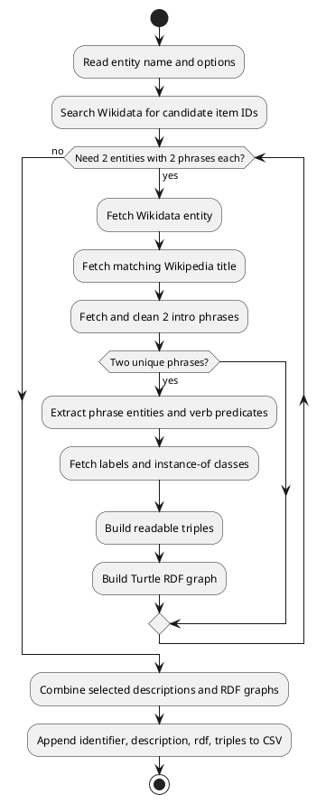

# Step 1: Generate Wikidata Description RDF

This step queries Wikidata, builds a short text description, and appends a row to
the base CSV with these columns:

```text
identifier,description,rdf,triples
```

The Turtle graph is stored in the CSV `rdf` column.

The CSV `description` contains exactly 4 cleaned introductory Wikipedia phrases:
2 phrases from each of 2 different matched Wikidata entities. If fewer than 2
different entities have 2 Wikipedia phrases each, no row is written.

The text is converted to subject-predicate-object triples first. When a resolved
description phrase has a nearby verb in the text, NLTK POS tagging and WordNet
are used to identify that verb, and the verb becomes the predicate. The Turtle
graph in `rdf` is then serialized from those extracted triples.

## Run

From the project root:

```powershell
pip install -r requirements.txt
```

```powershell
python generate/src/main.py "Mango"
```

Generate multiple rows by running the command once per entity:

```powershell
python generate/src/main.py "Grape"
python generate/src/main.py "Mango"
python generate/src/main.py "Watermelon"
python generate/src/main.py "banana"
python generate/src/main.py "Cocos nucifera"
```

Generate rows from a text file with one term per line:

```powershell
Get-Content ambiguous_words.txt | Where-Object { $_.Trim() } | ForEach-Object {
    python generate/src/main.py $_.Trim() --csv wikidata_description_rdf.csv
}
```

The command writes a CSV with `identifier,description,rdf,triples`
columns. `identifier` stores the requested entity name, such as `Jaguar`. The `rdf`
column stores Turtle, and the `triples` column is a JSON list where each item is
`[subject, predicate, object]` extracted from the text, using readable entity
labels when available.

## Options

```powershell
python generate/src/main.py "Watermelon" --lang en --csv wikidata_description_rdf.csv
```

| Option | Default | Description |
| --- | --- | --- |
| `name` | required | Wikidata entity name to search for. |
| `--lang` | `en` | Language used for labels and descriptions. |
| `--csv` | `wikidata_description_rdf.csv` | CSV file to append generated rows to. |

The CSV output is append-only. Delete or rename the output file first if you want
a fresh dataset.

## Flow

The generation process is also documented as PlantUML in
[`generate_flow.puml`](generate_flow.puml).
The extraction libraries and helper functions are documented in
[`extraction_libraries.md`](docs/extraction_libraries.md).



## Files

| File | Responsibility |
| --- | --- |
| `generate/src/main.py` | Command-line entry point for this step. |
| `generate/src/generate_pipeline/cli.py` | Generation orchestration and CLI implementation. |
| `generate/src/generate_pipeline/clients/` | Wikidata and Wikipedia API clients. |
| `generate/src/generate_pipeline/extraction/` | Description term and verb-derived relation extraction. |
| `generate/src/generate_pipeline/io/` | CSV rows, Turtle RDF, and explicit triple list writers. |
